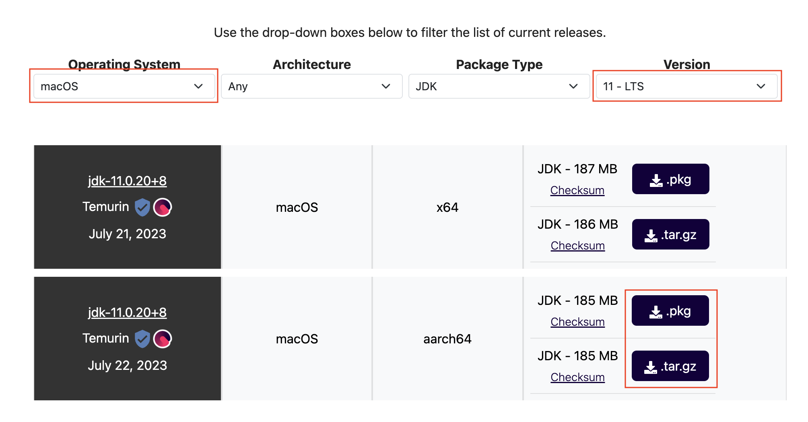

# Java 설치

## JRE VS JDK?

### JRE (Java Runtime Enviroment)

* JVM이 자바 프로그램을 동작시킬 때 필요한 라이브러리
* 즉 JVM(Java Virtual Machine)을 구현한 것으로 Java 프로그램을 실행할 수 있는 환경을 제공

### JDK (Java Development kit)

* 자바 개발을 위해 필요한 도구을 포함 (컴파일, 디버깅 및 실행하는데 필요한 모든 도구)
* JDK를 설치하면 JRE도 같이 설치 됨.
* 즉 JDK = JRE + 자바 개발을 위한 도구

## Eclipse Temurin

* JDK 11 - LTS download
  * <https://adoptium.net/temurin/releases/>


<br/>

**<p style="color: red; ">자바 버전은 11로 설치하시기 바랍니다!!!</style>**


- 다운로드 한 `.pkz` or `.tag.gz`를 압축 해제
- 압축 해제한 파일을 `~/Library/Java/JavaVirtualMachines`에 옮기기 (패스워드 입력은 맥 비밀번호)
  - 위 경로를 못 찾는 경우 아래 명령어를 터미널에서 실행

```console
$ cd /Library/Java/JavaVirtualMachines
$ open .
```

  
  
## JAVA_HOME 설정

- 다음 명령어들을 실행
```console
$ cd ~
$ vi .zshrc
```

- .zshrc에 내용 입력
  - `i` : 입력
  - `ESC` : 입력 종료
  - `:wq` : 저장 및 종료
```
JAVA_HOME=/Library/java/JavaVirtualMachines/jdk-11.0.20+8/Contents/Home
PATH=$PATH:$JAVA_HOME/bin
export JAVA_HOME
export PATH
```

```console
$ source .zshrc

$ java -version
openjdk version "11.0.20" 2023-07-18
OpenJDK Runtime Environment Temurin-11.0.20+8 (build 11.0.20+8)
OpenJDK 64-Bit Server VM Temurin-11.0.20+8 (build 11.0.20+8, mixed mode)
```

java -version시 위 출력이 나오면 됩니다.
