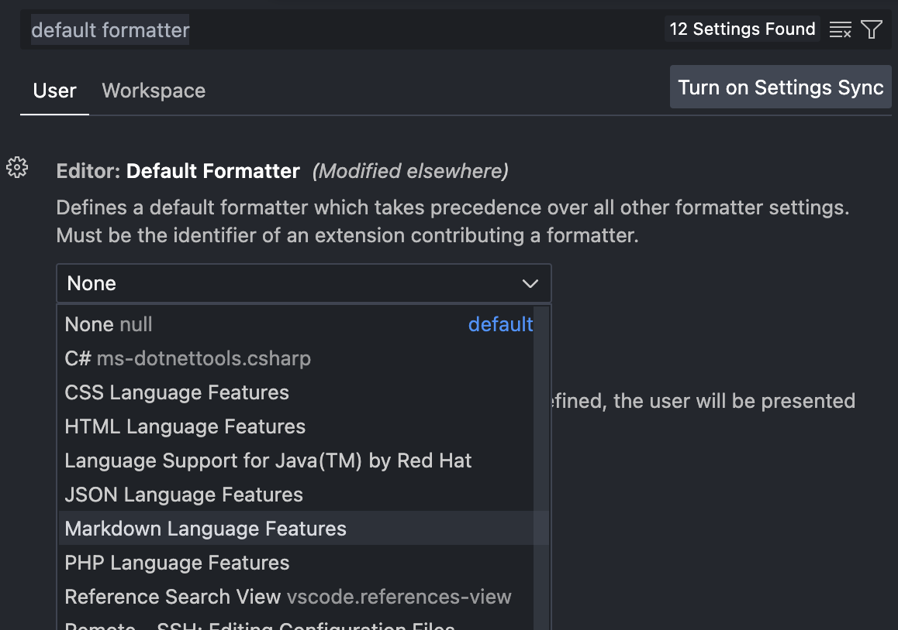
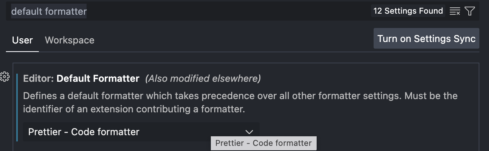
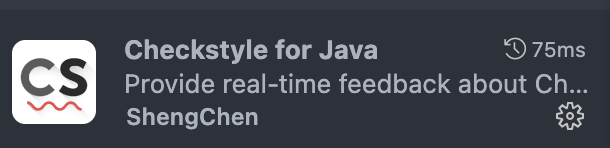

# VSCode Coding Convention 설정

## Code Style 적용 방법
- VSCode는 Intellij와 달리 Checkstyle을 이용한 code style 적용이 불가능함
- vscode에서 제공되는 formatter를 적용하거나

- code formatting 확장 플러그인(Prettier 등)을 사용하거나

- formatter 전용 파일을 다운받아 사용해야 함
- **하위에서는 Prettier 사용에 관해 설명**할 예정임

## 1. Prettier 플러그인 설치
- Prettier는 code style format을 제공하는 플러그인임
- `Extenstion` > `Prettier 설치`

## 2. Prettier 적용
- `cmd + ,` > `default formatter 검색` > `Defaut Formmater에서 Prettier 선택`

- 단축키 `option + shift + F`로 formmat이 적용된 자동 정렬을 사용할 수 있음

# VSCode CheckStyle 설정
## 1. CheckStyle 플러그인 설치
- Checkstyle for Java

## 2. CheckStyle 파일 다운로드
- Prettier format에 맞는 CheckStyle을 다운로드 받아줌
<https://github.com/jhipster/prettier-java/blob/main/docs/checkstyle/checkstyle.xml> 다운로드

3. `fn + F1` or `F1`(노트북 환경에 따라 다름) > `Checkstyle: Set the Checkstyle configuration file` > `Browse...` > 다운받은 CheckStyle 파일 선택
