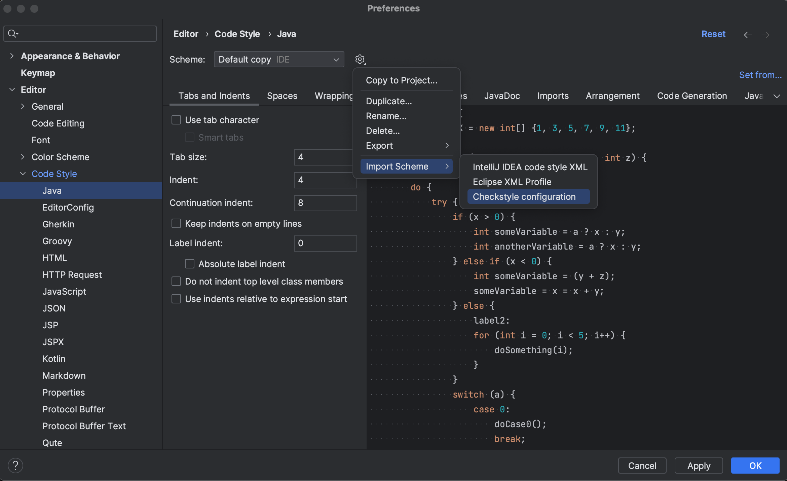
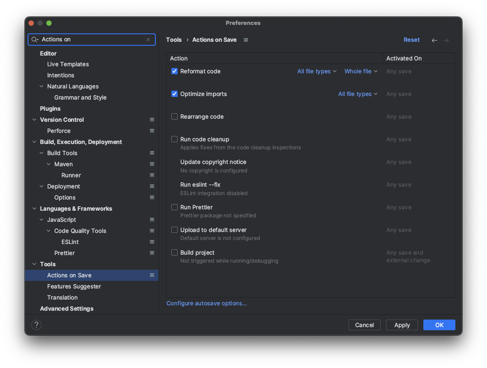

# Coding Convention

## 코딩 컨벤션(Coding Convention)

* 어떤 프로그래밍 언어를 사용해서 코드를 작성할 때 추천되는 프로그래밍 스타일에 대한 가이드라인
* 사람이 코드를 읽기 좋도록 하고 유지보수를 용이하게 하기 위해 최대한 가이드를 따를 것을 권장함
* 들여쓰기, 주석(comment), 공백 갯수, 네이밍 컨벤션 등의 내용을 포괄함

## Why Have Code Conventions

* [참고] <https://www.oracle.com/java/technologies/javase/codeconventions-introduction.html>
* 80% of the lifetime cost of a piece of software goes to maintenance.
  * 소프트웨어를 개발하는 일련의 모든 과정에 들어가는 비용 중 80%가 유지보수
* Hardly any software is maintained for its whole life by the original author.
  * 소프트웨어의 유지보수를 그 소프트웨어를 직접 개발한 개발자가 담당하는 경우는 드물다
* Code conventions improve the readability of the software, allowing engineers to understand new code more quickly and thoroughly.
  * 코딩 컨벤션은 다른 개발자가 그 소스코드를 처음 보았을 때, 더 빠른 시간에 완벽히 이해할 수 있도록 도와주기 때문에, 코드의 가독성이 높아진다.
* If you ship your source code as a product, you need to make sure it is as well packaged and clean as any other product you create.
  * 개발자가 자신의 소스 코드를 제품으로 팔고자 한다면, 자신이 작성한 코드가 다른 소스코드들과 잘 어울리도록 패키지(package)를 적절하게 구성할 필요가 있다.

## IntelliJ Code Style Fomatter
- Code Style을 직접 custom할 수도 있고, 제공되는 Code Style Fomatter를 사용하여 Code Style을 설정할 수 있음
- Check Style을 이용하여 Code Style을 설정할 수도 있음

### 1. 체크스타일 파일 다운로드 및 수정

- **google check** : <https://github.com/checkstyle/checkstyle/blob/master/src/main/resources/google_checks.xml> **다운로드**

- 해당 xml 파일을 열어 **일부 수정해야함!!**

1-1. 한 줄 max길이 수정
```xml
  <module name="LineLength">
    <property name="fileExtensions" value="java"/>
    <property name="max" value="100"/>
    <property name="ignorePattern" value="^package.*|^import.*|a href|href|http://|https://|ftp://"/>
  </module>

  ## 아래와 같이 변경
  <module name="LineLength">
    <property name="fileExtensions" value="java"/>
    <property name="max" value="120"/>
    <property name="ignorePattern" value="^package.*|^import.*|a href|href|http://|https://|ftp://"/>
  </module>
```

1-2. indent 수정
```xml
  <module name="Indentation">
    <property name="basicOffset" value="2"/>
    <property name="braceAdjustment" value="2"/>
    <property name="caseIndent" value="2"/>
    <property name="throwsIndent" value="4"/>
    <property name="lineWrappingIndentation" value="4"/>
    <property name="arrayInitIndent" value="2"/>
  </module>

  ## 아래와 같이 변경
  <module name="Indentation">
    <property name="basicOffset" value="4"/>
    <property name="braceAdjustment" value="4"/>
    <property name="caseIndent" value="4"/>
    <property name="throwsIndent" value="8"/>
    <property name="lineWrappingIndentation" value="8"/>
    <property name="arrayInitIndent" value="4"/>
  </module>
```


### 2. Code Style Fomatter 적용

* `Intellij IDEA` > `Preferences` > `Editor` > `Code Style` > `java` 항목선택


* `톱니바퀴 아이콘` > `Import Scheme` > `Checkstyle configuration` > `google_checks.xml`
* 코드 자동으로 정렬 단축키
  * Window : `ctrl` + `alt` + `L`
  * Mac : `option` + `cmd` + `L`

* 저장할 때 코딩 컨벤션 자동 적용
  * `Intellij IDEA` > `Preferences` > `Tools` > `Actions on Save`
  
  * Reformat code 체크
    * 저장시 자동으로 format 적용
  * Optimize Imports 체크
    * 저장시 사용하지 않는 Import 제거

