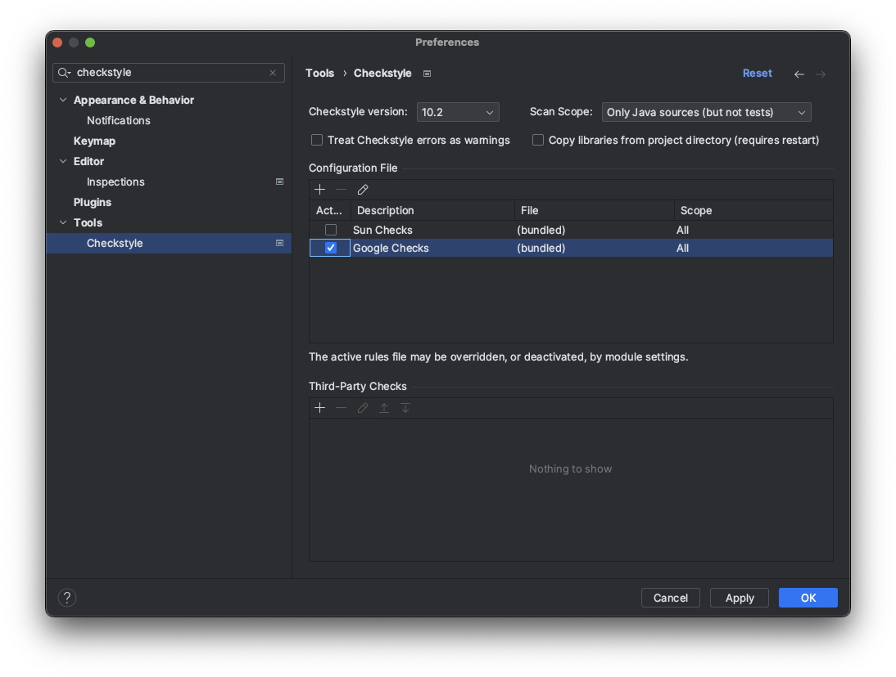
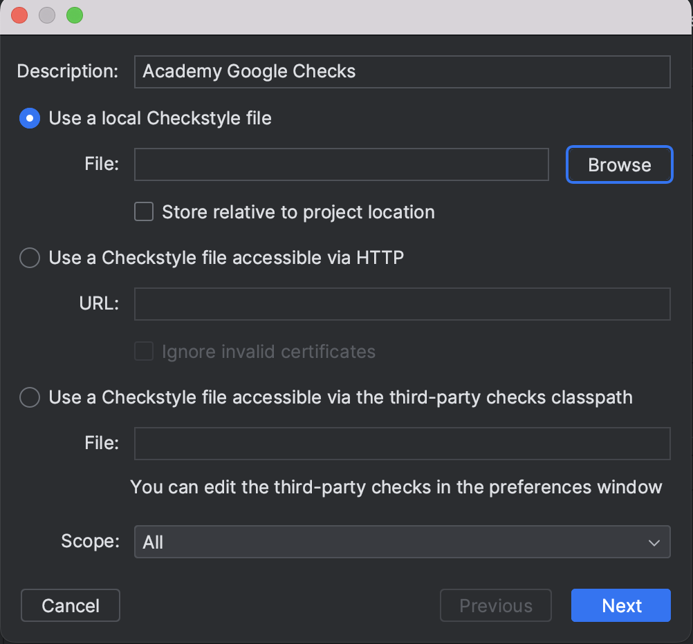
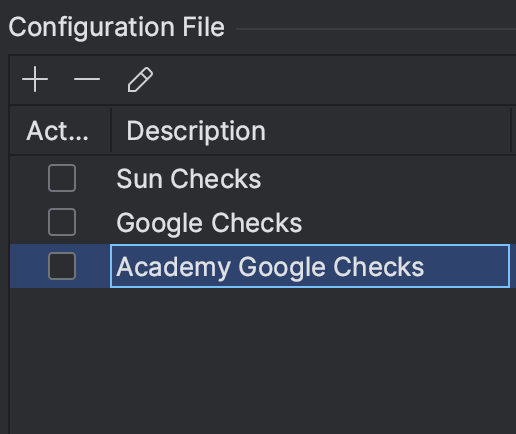
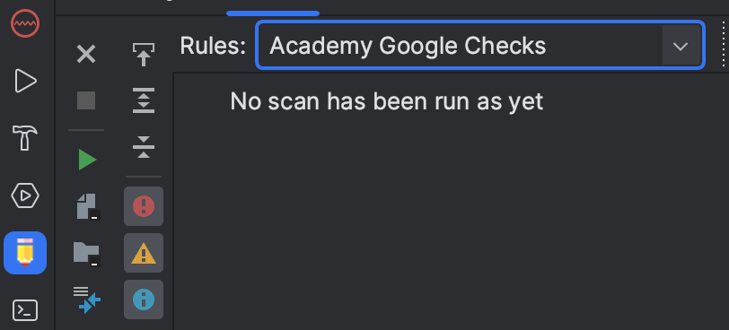
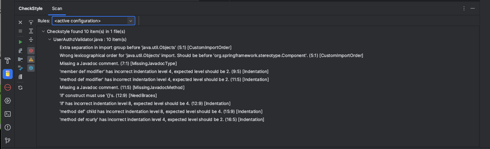

# CheckStyle

## CheckStyle이란?

* 작성된 코드가 코딩 컨벤션(Coding Convention)을 잘 따르고 있는 지 체크해주는 도구(정석 코드 분석 도구)
* 파일 단위, 프로젝트 단위로 체크 가능
* commit 시 연동 가능

## CheckStyle Plugin 설치

* https://plugins.jetbrains.com/plugin/1065-checkstyle-idea
* `command` + `,` > Plugins > `CheckStyle-IDEA`검색


* Restart Ide

## Google 코딩 컨벤션 설정

* `command` + `,` > Tools > CheckStyle
* `Google Checks` 설정


## 코딩 컨벤션 설정
### 1. 체크스타일 파일 다운로드 및 수정
- https://github.com/checkstyle/checkstyle/blob/master/src/main/resources/google_checks.xml 접속하여 다운로드
- xml 파일 **일부 수정해야함!**

1-1. 한 줄 max길이 수정
```xml
  <module name="LineLength">
    <property name="fileExtensions" value="java"/>
    <property name="max" value="100"/>
    <property name="ignorePattern" value="^package.*|^import.*|a href|href|http://|https://|ftp://"/>
  </module>

  ## 아래와 같이 변경
  <module name="LineLength">
    <property name="fileExtensions" value="java"/>
    <property name="max" value="120"/>
    <property name="ignorePattern" value="^package.*|^import.*|a href|href|http://|https://|ftp://"/>
  </module>
```

1-2. indent 수정
```xml
  <module name="Indentation">
    <property name="basicOffset" value="2"/>
    <property name="braceAdjustment" value="2"/>
    <property name="caseIndent" value="2"/>
    <property name="throwsIndent" value="4"/>
    <property name="lineWrappingIndentation" value="4"/>
    <property name="arrayInitIndent" value="2"/>
  </module>

  ## 아래와 같이 변경
  <module name="Indentation">
    <property name="basicOffset" value="4"/>
    <property name="braceAdjustment" value="4"/>
    <property name="caseIndent" value="4"/>
    <property name="throwsIndent" value="8"/>
    <property name="lineWrappingIndentation" value="8"/>
    <property name="arrayInitIndent" value="4"/>
  </module>
```

### 2. 체크스타일 추가
- `command` + `,` > Tools > CheckStyle
- Configuration File > Add 로 CheckStyle 추가

    - **Description** -> Academy Google Checks
    - **Use a local Checkstyle file** > file Browse 클릭 후, 다운받았던 checkstyle 파일 선택

- 체크 스타일을 성공적으로 추가했다면 하위와 같이 체크스타일이 보임


### 3. 체크스타일 실행
- 체크스타일을 추가하였으니, 체크스타일을 실행하여 소스 코드가 지정된 코딩 컨벤션을 준수하는지 확인해볼 수 있음
- 하위의 실행창에서 CheckStyle > Rules를 `Academy Google Checks` 로 지정

- 초록 화살표 아이콘(Check Current File)을 클릭하면, 현재 파일을 정적 분석하여 결과를 알려줌
- Module이나 Project 단위로 체크스타일을 실행할 수도 있음


## 정적분석


