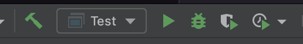

# Intellij를 이용한 디버깅

- intellij 오른쪽 상단의 벌레 모양 아이콘을 누르면 디버깅을 수행할 수 있음

## break point
- 프로그램을 의도적으로 멈추게 하는 장소
- 디버깅을 목적으로 break point를 설정하며, 이를 통해 내부의 다양한 값들을 확인하며 프로그램을 분석 & 검증할 수 있음

## debug 관련 기능

1. `Show Execution Point` -> 현재 디버깅되고 있는 위치를 보여줌
2. `Step Over` -> 한 줄 실행
3. `Step Into` -> 함수 내부로 들어감
4. `Step Out` -> 함수를 끝까지 실행시키고 호출시킨 곳으로 되돌아감 
5. `Run To Cursor` -> cursor가 있는 곳까지 실행. 단발성 break라고 생각하면 됨

