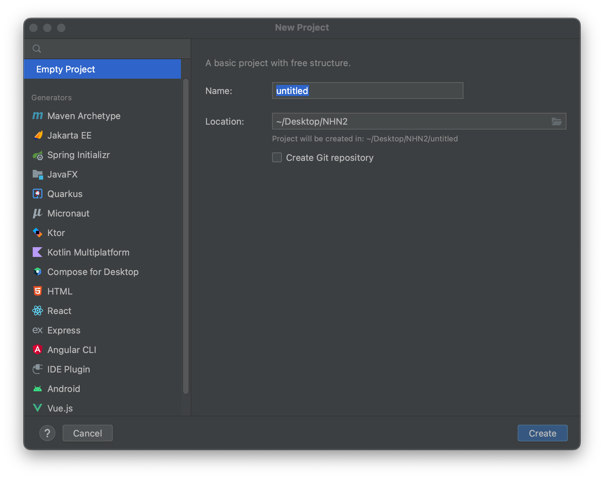
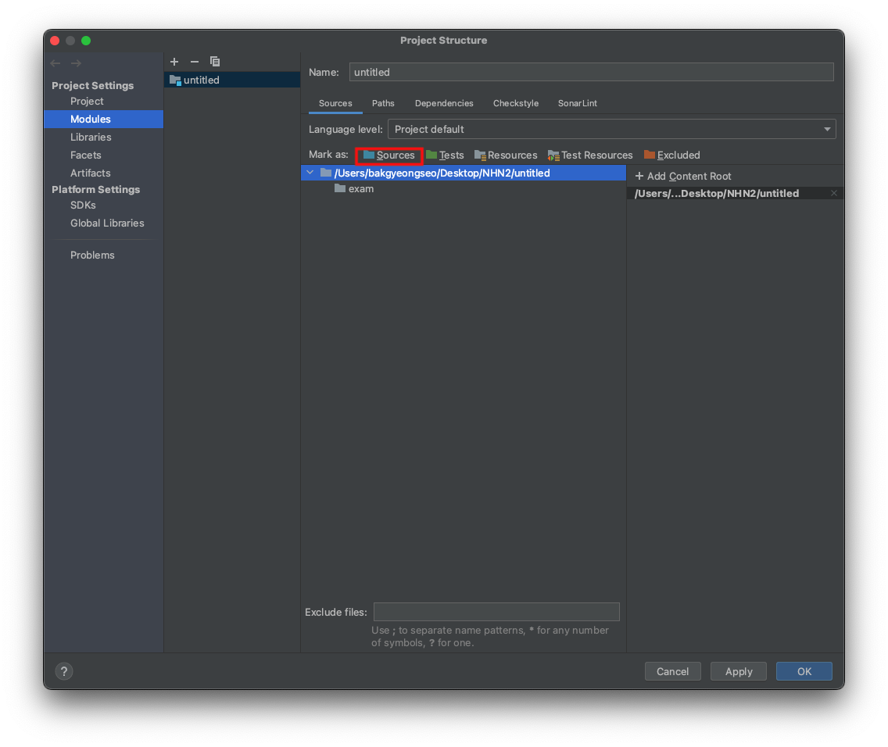
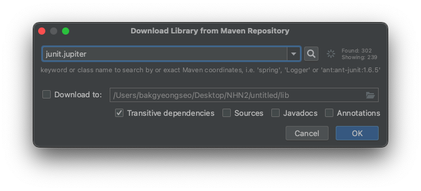

# Junit 5

## 프로젝트 생성

- Intellij -> New Project 



- 프로젝트 구조 설정 
    - 단축키 `command(⌘) + ;`
    - Sources 클릭




## 테스트 코드

**테스트 코드의 필요성**
- 프로그래밍에서 함수 및 메서드가 의도한 대로 잘 동작하는지 검증이 필요
- 프로그램을 작은 단위로 쪼개어 단위가 정확하게 동작하는지 검사함으로써 안정성을 높이는 과정


## Junit
- 자바 프로그래밍 언어용 유닛 테스트 프레임워크


### Junit5 라이브러리를 프로젝트에 추가

1. 프로젝트 구조 `command(⌘) + ;` -> Libraries -> `+` 클릭
2. Maven -> `junit.jupiter` 입력 후 검색



3. org.junit.jupiter:junit-jupiter:5.8.2 선택
4. Apply -> OK


### Junit5 사용

- `@Test`
    - 테스트 코드 실행 가능
- `@DisplayName`
    - 테스트 이름 지정
- Assertions.assertTrue()
- Assertions.assertFalse()
- Assertions.assertArrayEquals()
- Assertions.assertInstanceOf()
- Assertions.assertEquals()
- Assertions.assertThrows()
- ...
     
<br/>

**예제 Mathx Test 코드 작성 하기**
```java
public class Mathx {

    private Mathx() {
    }

    public static boolean odd(int num) {
        return num % 2 != 0;
    }

    public static int sum(int n1, int n2) {
        return n1 + n2;
    }

    public static int divide(int n1, int n2) {
        if (n2 == 0)
            throw new IllegalArgumentException("Can't divide by zero");

        return n1 / n2;
    }
}
```


<br/>

**실습**
- 선발시험 코드 `xxxTest.java`들을 Junit5로 옮기기
