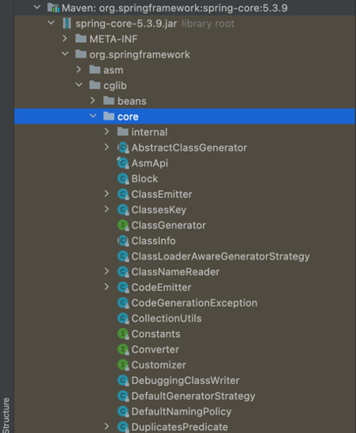

# Package

## Package란?

* class들의 모음

## 고유성

* package를 사용하는 이유는 클래스명의 고유성을 보장하기 위해서 사용합니다.
* 만약 다른 java프로그래머가 협업과정에서 서로 다른 목적을 가진 클래스를 생성 했는데 이름이 같다고 가정할 때, 서로 다른 패키지를 사용함으로써 충돌을 피할 수 있습니다.

## 최상위 패키지명은 도메인

* 최상위 패키지명에 도메인 주소를 앞뒤로 바꿔서 사용합니다.
* 이미 인터넷 도메인은 고유성을 가지고 있음으로 충돌에 대한 걱정할 필요가 없음

~~~ txt
com.nhnacademy.study ...
~~~

### GSON

* json관련해서 google에서 제공해주는 라이브러리 입니다.

~~~java
package com.google.gson;

public final class Gson {
 //...
}
~~~

### 폴더형식의 package 구조

* Springframework 페키지 구조
* 폴더구조형태로 계층적으로 구성되어 있음
* org.springframework.spring-core

## package 사용하는 방법

### 직접 package 주소를 명시

~~~java
public class Package01 {
    public static void main(String[] args) {
        java.util.List<String> list1 = new java.util.LinkedList<>();
        java.util.Collection<Integer> list2 = new java.util.ArrayList<>();
        java.util.Collections.sort(list1);
        java.util.Collections.reverse(list1);
        java.util.Collections.shuffle(list1);
    }
}
~~~

### Import

* `import java.util.*;`

~~~ java
import java.util.*;
public class Package01 {

    public static void main(String[] args) {
        List<String> list1 = new LinkedList<>();
        Collection<Integer> list2 = new ArrayList<>();
        Collections.sort(list1);
        Collections.reverse(list1);
        Collections.shuffle(list1);
    }

}
~~~

### Static Import

* `import static java.util.Collections.*;`
* `import static java.util.Collections.sort;`

~~~ java
import java.util.*;
import static java.util.Collections.*;
import static java.util.Collections.sort;
public class Package01 {

    public static void main(String[] args) {
        List<String> list1 = new LinkedList<>();
        Collection<Integer> list2 = new ArrayList<>();
        sort(list1);
        reverse(list1);
        shuffle(list1);
    }

}
~~~

