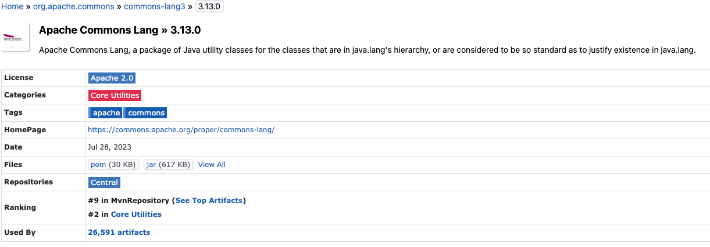

# jar

## jar란?

* java에서 제공하는 압축 파일, `zip 압축`
* `class 파일`, `resource(텍스트,이미지)`, .. 메타데이터를 하나로 모아서 Java 플랫폼에 응용소프트웨어나 라이브러리를 배포하기위한 소프트애어 패키지 파일
* 컴파일된 class 파일을 jar 묶어서 배포하면 , 경로나 파일의 위치에 상관없이 프로그램 실행 가능

## Java open source 생태계

* java 진형의 다양한 오픈소스들은 특정 저장소를 통해서 jar 형태의 파일로 제공됩니다.
* Package Manager인 Maven, Gradle를 통해서 해당 라이브러리를 추가할 수 있습니다.
* <http://mavenrepository.com>
* Apache Commons Lang 검색

