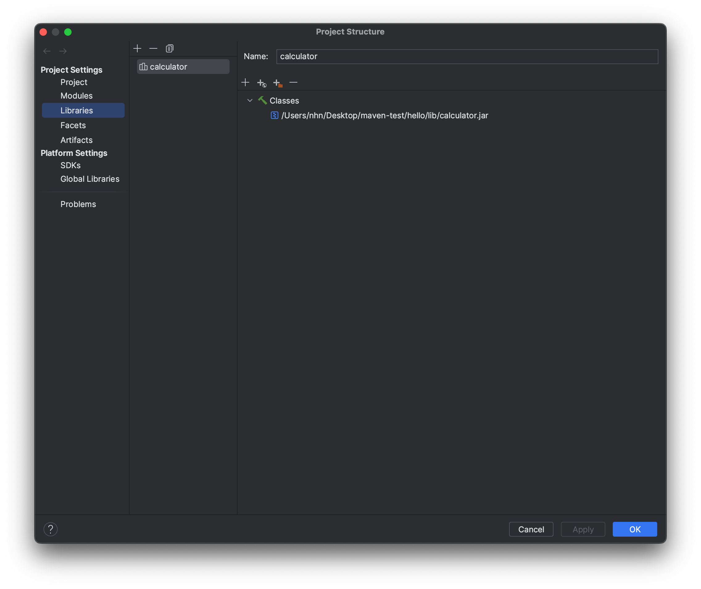

# hello.jar

* `hello java!`를 출력하는 jar 만들기

## Intellij Project 생성

* File > New > Project > New Project
  * Build system : intellij
  * jdk : 11


### pacakge 설정

* com.nhnacademy.hello

``` java
package com.nhnacademy.hello;

public class Main {

  public static void main(String[] args) {
    System.out.println("Hello java!");
  }
}
```

## The jar Command

* <https://docs.oracle.com/en/java/javase/17/docs/specs/man/jar.html>

### create hello.jar

```sh
cd out/production/hello

 jar --create --file  hello.jar --main-class com.nhnacademy.hello.Main -c ./com

```

### execute hello.jar

```sh
java -jar hello.jar 
```

### jar파일의 내용 확인

```sh
jar -tf hello.jar 
```

### jar 압축풀기

```sh
unzip hello.jar 
```

* META-INF/MANIFEST.MF에 다음과 같이 생성 되어있는 것을 확인할 수 있습니다.

```text
Manifest-Version: 1.0
Created-By: 11.0.18 (Eclipse Adoptium)
Main-Class: com.nhnacademy.hello.Main
```

## 실습 calculator.jar 만들기

* intellij에서 새로운 프로젝트를 생성합니다.

```java
package com.nhnacademy.hello.util;

public final class Calculator {

  private Calculator(){
    throw new IllegalStateException("Utility class!");
  }

  public static int plus(int a, int b){
    return a+b;
  }
  
  public static int subtract(int a, int b){
    return a-b;
  }

  public static int multiply(int a, int b){
    return a*b;
  }

  public static int divide(int a, int b){
    return a/b;
  }

}
```

* project build : `command` + `F9`

## `calculator.jar` Library `hello` project에서 실행

### hello project >  lib/calculator.jar 경로에 복사

* Project Structure `command` + `;`
* Libraries >  calculator jar 추가




### hello project > Main.java

``` java
package com.nhnacademy.hello;

import com.nhnacademy.hello.util.Calculator;

public class Main {

  public static void main(String[] args) {
    System.out.println("Hello java!");

    System.out.println("더하기:" + Calculator.plus(20,10));
    System.out.println("빼기:" + Calculator.subtract(20,10));
    System.out.println("나누기:" + Calculator.divide(20,10));
    System.out.println("곱하기:" + Calculator.multiply(20,10));
  }
}
```

### Main 실행

```console
Hello java!
더하기:30
빼기:10
나누기:2
곱하기:200
```

### jar를 실행하면?

```sh
hello % java -jar hello.jar 
```

```sh
Hello java!
Exception in thread "main" java.lang.NoClassDefFoundError: com/nhnacademy/hello/util/Calculator
        at com.nhnacademy.hello.Main.main(Main.java:10)
Caused by: java.lang.ClassNotFoundException: com.nhnacademy.hello.util.Calculator
        at java.base/jdk.internal.loader.BuiltinClassLoader.loadClass(BuiltinClassLoader.java:581)
        at java.base/jdk.internal.loader.ClassLoaders$AppClassLoader.loadClass(ClassLoaders.java:178)
        at java.base/java.lang.ClassLoader.loadClass(ClassLoader.java:522)
        ... 1 more
nhn@AL01591468 hello % 
```

* `java.lang.NoClassDefFoundError 발생`

### `-cp` (class path) 지정해서 실행

```sh
java -cp "./hello.jar:./calculator.jar" com.nhnacademy.hello.Main
```
