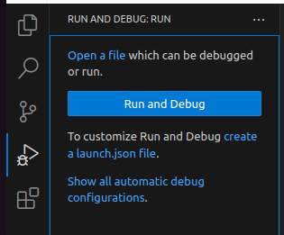
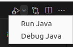

# Debugging Tool

### [Debugging][^debug]이란?
- 컴퓨터 프로그램 개발 단계 중에 발생하는 시스템의 논리적 오류나 비정상적인 연산(버그)을 찾아내 그 원인을 밝히고 수정하는 작업 과정
- Debugger : 디버깅을 돕는 도구

## Visual Studio Code의 Debugger
- VSCode 왼쪽 상단의 Run and Debug 또는 오른쪽 상단 Debug Java 눌러 디버깅 가능

## Break point
- 프로그램을 의도적으로 멈추게 하는 장소
- 디버깅을 목적으로 break point를 설정하며, 이를 통해 내부의 다양한 값들을 확인하며 프로그램을 분석 & 검증할 수 있음

## debug 관련 기능

1. `continue`(F5) -> 다음 break point를 만날때까지 계속 진행
2. `Step Over`(F10) -> 한 줄 실행
3. `Step Into`(F11) -> 함수 내부로 들어감
4. `Step Out`(shift+F11) -> 함수를 끝까지 실행시키고 호출시킨 곳으로 되돌아감 
5. `Restart`(ctrl+shift+F5) -> 재시작 
6. `Stop`(shift+F5) -> 디버깅 중지
7. `Hot Code Replace` -> 자바용 디버거 동작 중에 새로운 클래스 파일의 변경이 있으면 그 변경된 파일을 자동으로 교체하는 디버깅 기술

[^debug]: https://ko.wikipedia.org/wiki/%EB%94%94%EB%B2%84%EA%B7%B8