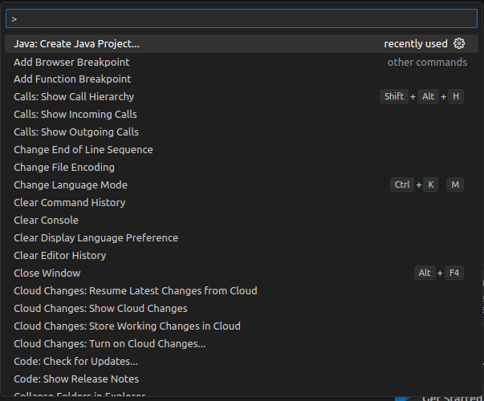
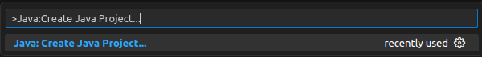
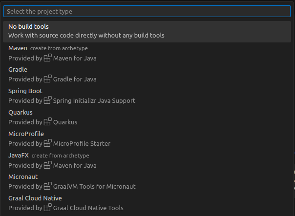
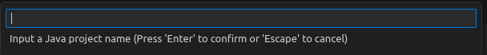
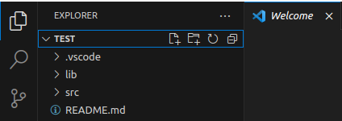
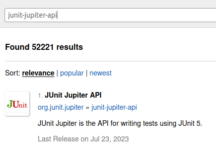
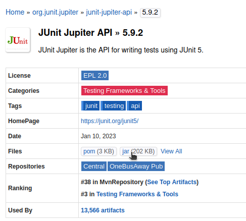
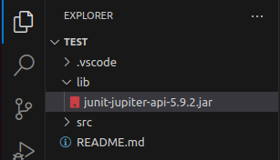

# Junit5

## 프로젝트 생성
- Ctrl + Shift + P : VSCode 명령어 팔레트 열기
    

- 명령어 팔레트를 열어 
    1. `Java:Create Java Project...` 실행
        
    2. `No build tools` 선택 후 파일 위치 지정
        
    3.  프로젝트 이름 설정
        
    4. 프로젝트 생성 완료
        

## 테스트 코드

**테스트 코드의 필요성**
- 프로그래밍에서 함수 및 메서드가 의도한 대로 잘 동작하는지 검증이 필요
- 프로그램을 작은 단위로 쪼개어 단위가 정확하게 동작하는지 검사함으로써 안정성을 높이는 과정

## Junit
- 자바 프로그래밍 언어용 단위 테스트 프레임워크

### Junit5 라이브러리를 프로젝트에 추가

1. https://mvnrepository.com/ 접속
2. 필요 라이브러리
    - junit-jupiter-api-version.jar
        
    <!-- - junit-platform-console-standalone-version.jar -->
    <!-- - 추가적 : hamcrest-verion.jar -->
3. 버전 선택 후 .jar 파일 다운로드
    
4. 프로젝트의 **lib** 로 다운로드 받은 .jar 파일 이동
    

 

### Junit5 어노테이션

- `@Test`
    - 테스트 코드 실행 가능
    - 테스트 메소드임을 나타냄
- `@DisplayName`
    - 테스트 클래스 또는 테스트 메서드에 대한 이름 선언
- `@BeforeEach`
    - 각 테스트 메소드가 실행되기 전 실행되어야 하는 메소드를 명시
- `@AfterEach`
    - 각 테스트 메소드가 실행되고 난 후 실행
- `@BeforeAll`
    - 테스트 시작하기 전 딱 한 번만 실행
- `@AfterAll`
    - 테스트가 완전히 끝난 후 딱 한 번만 실행
- `@Disabled` 
    - 테스트 클래스나 테스트 메소드 비활성화

 

- `@ParameterizedTest`
    - 파라미터로 넘겨줄 값을 지정해 여러번 반복될 테스트를 한번에 작성해 실행 가능
- `@RepeatedTest`
    - 반복 횟수를 지정해 테스트 실행 가능
- 등등...

 

### Assertions
- org.junit.jupiter.api.Assertions 클래스 안에 있는 메서드
    - Assertions.assertTrue()
    - Assertions.assertFalse()
    - Assertions.assertArrayEquals()
    - Assertions.assertInstanceOf()
    - Assertions.assertEquals()
    - Assertions.assertThrows()
    - 등등...
     
 

